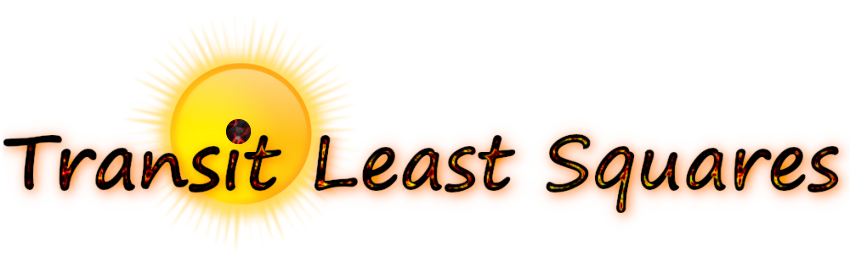
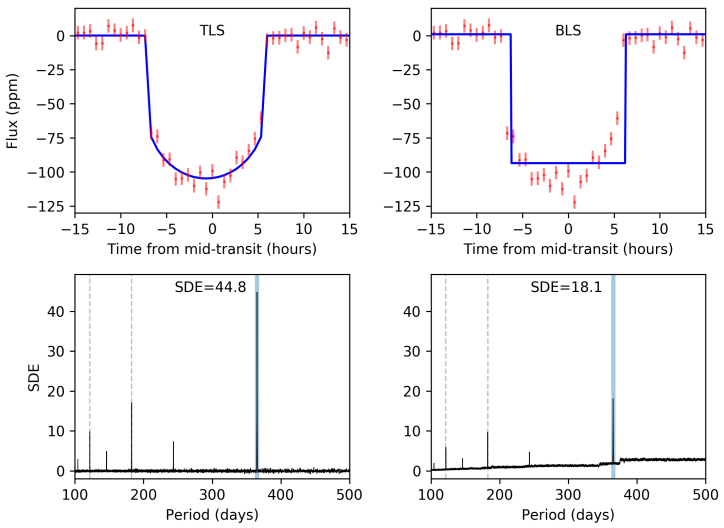

### An optimized transit-fitting algorithm to search for periodic transits of small planets
[](https://github.com/hippke/tls/blob/master/LICENSE)
[](https://pypi.org/project/transitleastsquares/)
[](https://pypi.org/project/transitleastsquares/)
[](https://transitleastsquares.readthedocs.io/en/latest/index.html)
[](https://github.com/hippke/tls/tree/master/tutorials)
[](https://arxiv.org/abs/1901.02015)


## Motivation
We present a new method to detect planetary transits from time-series photometry, the *Transit Least Squares* (TLS) algorithm. While the commonly used Box Least Squares [(BLS, Kovács et al. 2002)](http://adsabs.harvard.edu/abs/2002A%26A...391..369K) algorithm searches for rectangular signals in stellar light curves, *TLS* searches for transit-like features with stellar limb-darkening and including the effects of planetary ingress and egress. Moreover, *TLS* analyses the entire, unbinned data of the phase-folded light curve. These improvements yield a ~10 % higher detection efficiency (and similar false alarm rates) compared to BLS. The higher detection efficiency of our freely available Python implementation comes at the cost of higher computational load, which we partly compensate by applying an optimized period sampling and transit duration sampling, constrained to the physically plausible range. A typical Kepler K2 light curve, worth of 90 d of observations at a cadence of 30 min, can be searched with *TLS* in about half a second on a standard laptop computer (after a one-time JIT compilation of a few seconds) — as fast as BLS.



## What's new in TLS 2.0
* **30–60x faster** than TLS 1.33 on warm benchmarks, with unchanged detection rates: a rewritten numba kernel stack evaluates the same statistic using algebraic correlations, prefix sums and validated approximations. The default backend is validated against the exact statistic on hundreds of injection-recovery cases; the `backend="fused"` backend is exact up to rounding and bit-identical to the original algorithm.
* **18 bug fixes**, 10 of which change results (among them: a weighted final T0 fit, a correct out-of-transit noise estimate for the SNR, honest reporting when no transit is fit, and honouring user-supplied stellar limits and template parameters). The duration-limit mass pairing reported by Talens et al. (2026) is fixed.
* **Own limb-darkened transit model** — [batman](https://www.cfa.harvard.edu/~lkreidberg/batman/) is no longer a runtime dependency (it remains an optional dependency for the test suite).
* **Opt-in analytic SDE background** detrending: `power(SDE_detrend="hybrid")` (see the [documentation](https://transitleastsquares.readthedocs.io/en/latest/index.html)).
* Pluggable search backends (`power(backend=...)`), modern packaging (`pyproject.toml`), and a golden test set that freezes all result fields.

## Installation

TLS can be installed conveniently using: `pip install transitleastsquares`

If you have multiple versions of Python and pip on your machine, try: `pip3 install transitleastsquares`

The latest version can be pulled from github:
```
git clone https://github.com/hippke/tls.git
cd tls
pip install .
```

For an editable (development) install, use `pip install -e .` instead of the last line.

Dependencies:
Python 3.9+ (tested up to 3.14),
[NumPy](http://www.numpy.org/) (>= 1.22),
[numba](http://numba.pydata.org/),
[tqdm](https://github.com/tqdm/tqdm),
optional:
[astroquery](https://astroquery.readthedocs.io/en/latest/) (for LD and stellar density priors from Kepler K1, K2, and TESS),
[batman-package](https://www.cfa.harvard.edu/~lkreidberg/batman/) (only needed to run the test suite).

If you have trouble installing, please [open an issue](https://github.com/hippke/tls/issues).


## Getting started
Here is a short animation of a real search for planets in Kepler K2 data (K2-3, searched in 0.4 s with TLS 2.0). For more examples, have a look at the [tutorials](https://github.com/hippke/tls/tree/master/tutorials) and the [documentation](https://transitleastsquares.readthedocs.io/en/latest/index.html).


## Attribution
Please cite [Hippke & Heller (2019, A&A 623, A39)](https://ui.adsabs.harvard.edu/#abs/2019A&A...623A..39H/abstract) if you find this code useful in your research. The BibTeX entry for the paper is:

```
@ARTICLE{2019A&A...623A..39H,
       author = {{Hippke}, Michael and {Heller}, Ren{\'e}},
        title = "{Optimized transit detection algorithm to search for periodic transits of small planets}",
      journal = {\aap},
         year = "2019",
        month = "Mar",
       volume = {623},
          eid = {A39},
        pages = {A39},
          doi = {10.1051/0004-6361/201834672},
archivePrefix = {arXiv},
       eprint = {1901.02015},
 primaryClass = {astro-ph.EP},
       adsurl = {https://ui.adsabs.harvard.edu/\#abs/2019A&A...623A..39H},
      adsnote = {Provided by the SAO/NASA Astrophysics Data System}
}
```

## Contributing Code, Bugfixes, or Feedback
We welcome and encourage contributions. If you have any trouble, [open an issue](https://github.com/hippke/tls/issues).

Copyright 2019-2026 Michael Hippke & René Heller.
