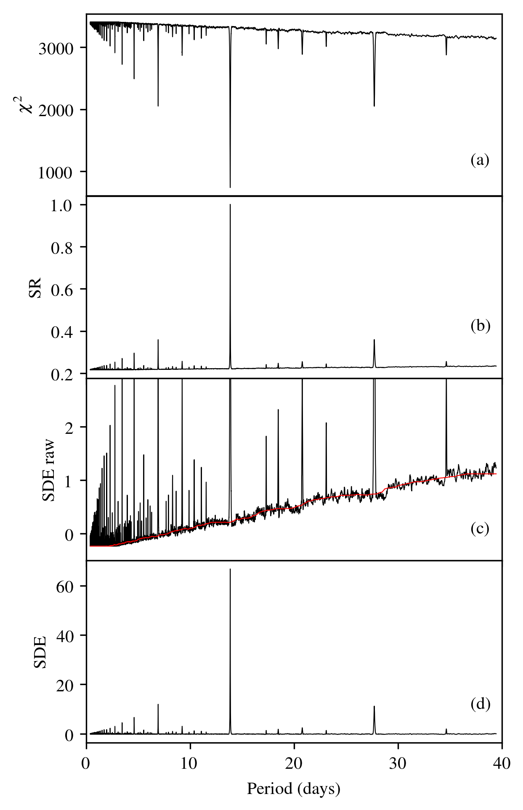
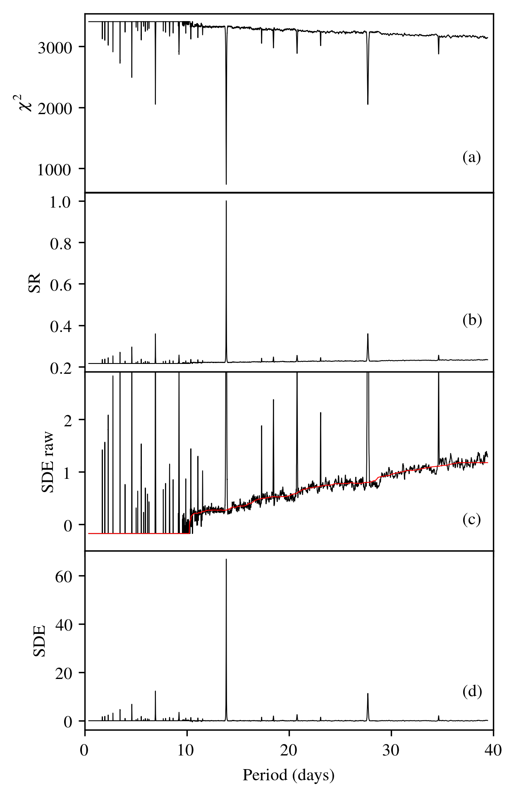

FAQ
================

Frequently asked questions.

Is TLS always better than BLS?
------------------------------
No, but almost always! 

- For >99.9% of all known transiting planets, TLS recovers the transits at a higher significance than BLS, as a transit is almost always better fit to the data than a box. This assumes limb-darkening estimates from the usual catalogs to be used with TLS. If no limb-darkening estimates are available, TLS is better for >99% of the known planets.
- The remaining cases are mostly grazing transits (V-shaped), for which TLS offers a dedicated template to maximize sensitivity (see tutorials and documentation)
- A very few real-life cases are limb-darkened transits which are distorted by noise so that they occur to be more box-like than transit-like. On average, however, this is very rare. If you like to search for box-like transits, you can also use TLS and choose a trapezoid-shaped template (again, see tutorials and documentation). Using TLS over BLS to search for box-like transit makes sense, because TLS offers the optimal period grid and optimal duration grid (assuming you have prior information on stellar radius and mass from the K2, EPIC, TESS etc. catalog). Also, TLS searches for a *true* trapezoid (with steep ingress and egress), whereas BLS searches for an (unphysical) step function.
- In terms of recovery rate for a chosen false alarm rate: From an experiment of 10k white noise injection and retrievals, we find that for any threshold, the recovery rate of true positives (the planets) is *always* better for TLS, compared to BLS. For example, the recovery rate at a false alarm threshold of 1% is better for TLS than for BLS, and this holds for any other threshold, such as 0.1%, 0.01% etc. Setting the SDE threshold is similar to BLS (see next section).

False alarm probability
------------------------

From an experiment with >10000 white noise-only TLS search runs, we can estimate false alarm probabilities (FAP) as follows:

======   =====
1-FAP    SDE 
======   =====
0.9      5.7
0.95     6.1
0.99     7.0
0.999    8.3
0.9999   9.1
======   =====

In noise-only data, 1% of the observed cases (1-FAP=0.99) had an SDE>7.0. If an SDE of 9.1 is observed in a data set, the probability of this happening from noise fluctuations is 0.01%. This assumes Gaussian white noise. Real data often has partially correlated (red) noise. Then, the FAP estimates are too optimistic, i.e., high SDE values will occur more often than measured in the experiment. Vice versa, the SDE values per given FAP value will be higher in red noise. 

TLS returns the FAP value per SDE as ``results.FAP`` (see Python interface).

Truncation of the power spectrum
------------------------------------------

The Figure below (left panel) is taken from the paper (Figure 3) and shows (a): the :math:`\chi^2` distribution (b): The signal residue (c): the raw signal detection efficiency and (d): the signal detection efficiency (SDE) used by TLS, smoothed with a walking median. This plot was made using the default parameters in TLS.

In the right panel, the only change is ``transit_depth_min=200*10**-6``. That is, we decide not to fit any transits shallower than 200ppm (instead of 10ppm). As a consequence, no transits were fit for many short periods (these are smoother in phase space). The resulting spectrum contains maximum :math:`\chi^2` values (where the signal is taken as unity) for many periods, resulting in SDE values of zero. With a lower baseline, the actual SDE peaks may be **higher** (remember: the SDE power spectrum is normalized to its standard deviation). Despite the higher peaks, the information content is lower, as true signals may be missed, and no additional information is introduced.

|pic1| any text |pic2|

How fast is TLS?
----------------

Very fast! It can search an entire unbinned Kepler K2 lightcurve (90 days, 4000 datapoints) for the best-fit limb-darkened transit model in a few seconds on a typical laptop computer.

In a typical K2 light curve (e.g., EPIC 201367065), TLS (default configuration) performs :math:`3\times10^8` light curve evaluations in the :math:`\chi^2` sense, over 8500 trial periods, each including a transit and the out-of-transit part of the light curve. 

A single phase-folded light curve evaluation calculates the squared residuals of the best-fit limb-darkened model light curve to the data points. It pulls the out-of-transit residuals from a cache (if re-usable from previous models) or calculates and caches them. In the end, it returns the :math:`\chi^2` of this model to the main routine. One such individual model comparison consumes (on average) 230 ns of wall-clock time on one core of an Intel Core i5-6300U at 2.4 GHz.

The average number of in-transit points (in the phase-folded view), i.e. the transit duration in cadences, is 138 (in this example). Considering the out-of-transit points, almost :math:`10^{13}` squared-residuals-calculations would be required. Through careful evaluation of which out-of-transit points have previously been calculated and can be re-used, ~96% of these repetitive calculations can be avoided.

In Kepler K2 light curves, on average ~53% of the total compute time is required for phase-folding and sorting. Sorting is set to use numpy's `MergeSort` algorithm which is implemented in the C language. This is slightly faster than the more commonly used `QuickSort`, because phase-folded data is already partially sorted.

But: TLS is written in Python and JIT-compiled with numba. How much faster would a pure C or Fortran implementation be? Not much faster, if faster at all. The innermost numba-loop which calculates the residuals in the :math:`\chi^2` sense has been measured with a throughput of 12.2 GFLOPs on a single core on an Intel Core i5-6300U at 2.4 GHz. The manufacturer spec-sheet gives a maximum of 16.9 GFLOPs per core at this clock speed, i.e. TLS pulls 72% of the theoretical maximum. The remaining fraction is very difficult to pull, as it includes a relevant amount of I/O in the form of array shifts. It may be possible to shave off a few percent using hand-optimized assembly, but certainly not more than of order 10%.

Edge effect jitter correction
-----------------------------

TLS fully compensates for the BLS edge effect jitter effect, which we discovered and described in our paper `(Hippke & Heller 2019, appendix B) <https://arxiv.org/pdf/1901.02015.pdf>`_. A visualization of this effect on the statistic is shown in an `iPython tutorial <https://github.com/hippke/tls/blob/master/tutorials/08%20Edge%20effect%20jitter%20correction.ipynb>`_, using synthetic data.

The original BLS implementation did not account for transit events occurring to be divided between the first and the last bin of the folded light curve. This was noted by Peter R. McCullough in 2002, and an updated version of BLS was made (`ee-bls.f`) to account for this edge effect. The patch is commonly realized by extending the phase array through appending the first bin once again at the end, so that a split transit is stitched together, and present once in full length. The disadvantage of this approach has apparently been ignored: The test statistic is affected by a small amount of additional noise. Depending on the trial period, a transit signal (if present) is sometimes partly located in the first and the second bin. The lower (in-transit) flux values from the first bin are appended at the end of the data, resulting in a change of the ratio between out-of-transit and in-transit flux.

There are phase-folded periods with one, two, or more than two bins which contain the in-transit flux. This causes a variation (over periods) of the summed noise floor, resulting in additional jitter in the test statistic. For typical Kepler light curves, the reduction in detection efficiency is comparable to a reduction in transit depth of ~0.1-1 %. TLS corrects this effect by subtracting the difference of the summed residuals between the patched and the non-patched phased data. In real data, the effect is usually overpowered by noise, and was thus ignored, but is nonetheless present.

Small period trial ranges
-----------------------------

TLS can be parametrized to search over a restricted period range using ``period_min`` and ``period_max``. TLS will then create an optimal period search grid in  ``[period_min, ..., period_max]``. If the range is very small, only a few periods would be tested. This works in the least-squares (:math:`\chi^2`) sense, i.e. it would detect the period with the smallest residuals for our transit model. With only a few period trials, however, no ``power`` spectrum can be created (sometimes called "SDE-ogram"). This is because ``power`` is normalized by its standard deviation, and a standard deviation of just a few (noisy) points is not meaningful. The most common detection criteria is the SDE, often required to be >9 for a signal to be considered interesting. As the SDE is located at the maximum of ``power``, it can not be calculated without it. Thus, a small number of period trials are problematic. A large number of periods result in a robuster estimate of the ``power`` noise floor, and this in a robuster estimate of the height of the peak, the SDE.

TLS solves the issue of very small period ranges by requiring at least 100 trial periods, and extends the period range to its (large) defaults if the grid is too small based on the supplied parameters. Thus, if you set ``period_min=365.2`` and ``period_max=365.3``, TLS will probably default to a larger range (depending on your stellar mass, radius, and oversampling parameter). This is displayed at the start of each TLS run:

``Searching 18113 data points, 4726 periods from 0.602 to 27.867 days``

You can use this information to increase your period search range accordingly.